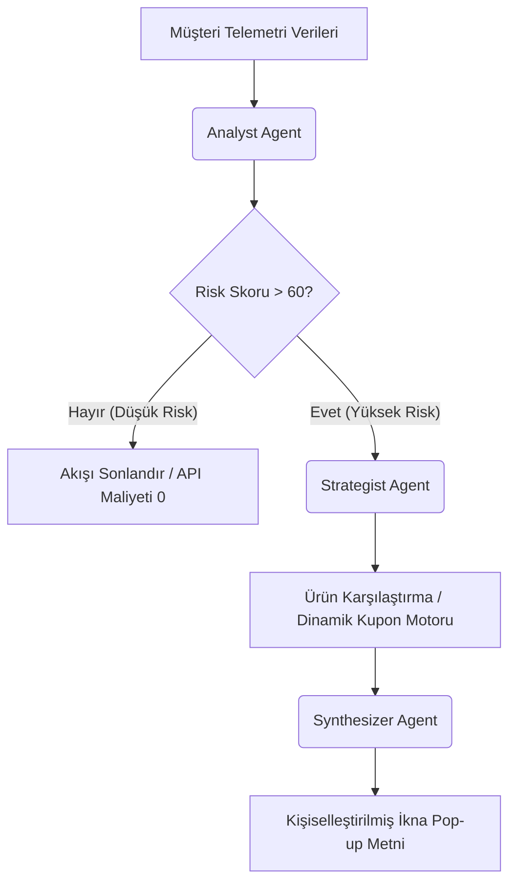

<div align="center">
  
  <h1>CartCoach</h1>
  <p><strong>Yapay Zeka Odaklı Otonom Sepet Kurtarma ve İkna Sistemi</strong></p>
  <p><i>Google AI & BTK Hackathon 2026 - E-Ticaret Kategorisi</i></p>
</div>

---

## 🚀 Vizyon ve Problem Tanımı

Küresel e-ticaret ekosisteminde **sepet terk etme oranları ortalama %70** seviyesindedir. Mevcut çözümler (statik "sepetinizde ürün unuttunuz" e-postaları veya siteyi kapatırken çıkan jenerik %10 indirim pop-up'ları) bağlamdan yoksundur, kişiselleştirilmemiştir ve müşteride karşılık bulmamaktadır.

**CartCoach**, kullanıcının site içi davranışlarını (imleç hareketleri, hareketsizlik süresi, sepet içeriği, sepet tutarı) anlık olarak analiz eden ve tam sepet terk edilmek üzereyken devreye giren **otonom bir "satış kapama" ve ikna ajanıdır.**

### 💰 Doğrudan Yatırım Getirisi (ROI)
CartCoach, e-ticaret işletmeleri için doğrudan gelir artırıcı bir yatırımdır. Örnek bir finansal kurtarım tablosu:

| Aylık Terk Edilen Sepet Tutarı | Hedeflenen Kurtarma Oranı | Aylık Net Gelir Kurtarımı | Yıllık İlave Ciro Kazanımı |
| :--- | :--- | :--- | :--- |
| **1.000.000 TL** | **%15 (Otonom İkna)** | **150.000 TL** | **1.800.000 TL** |

*İşletme, sadece kâr marjı dahilindeki esneklik limitlerini (örn: maksimum %10-15 indirim) sisteme tanımlar; kalan tüm kişiselleştirilmiş pazarlık sürecini yapay zeka ajanları yönetir.*

---

## 🧠 Multi-Agent (Çoklu Ajan) Mimarisi (LangGraph)

CartCoach, basit bir Chatbot veya statik bir prompt tetikleyicisi değildir. **LangGraph** tabanlı, durum (state) yönetimi olan ve kararları otonom alan gelişmiş bir *Agentic* yapıya sahiptir.



### Ajan Rolleri:
1. **Analyst Agent (Veri Analisti):** Frontend'den gelen telemetri verilerini inceler ve anlık **Terk Skoru** (0-100) ile **Müşteri Profili** (fiyat duyarlı, kararsız, odaklanmış) üretir.
2. **Strategist Agent (Karar Mekanizması):** Risk skoru yüksekse devreye girer. Kullanıcının profiline göre esneklik limiti dahilinde en uygun satış stratejisini kurgular (indirim kuponu üretimi veya karşılaştırma tablosu hazırlama).
3. **Synthesizer Agent (İletişim Sentezleyici):** Stratejistin aldığı kararları, markanın ses tonuna uygun, empati yeteneği yüksek ve samimi bir pop-up mesajına dönüştürür.

---

## ⚡ Gemini API Maliyet & Performans Optimizasyonu

Yüksek trafikli e-ticaret sitelerinde yapay zeka API maliyetleri en büyük endişedir. CartCoach mimarisi bu maliyeti minimize etmek üzere **Route & Model Switching** mantığıyla tasarlanmıştır:

* **Koşullu Yönlendirme (Conditional Edge):** Analyst ajanı risk skorunu düşük (örn: < 60) bulursa, LangGraph grafiği hemen sonlandırır. Diğer ajanlar tetiklenmez ve **gereksiz API maliyeti %0'a iner**.
* **Model Dağılımı:** Hızlı ve şablonlu işler için hafif modeller kullanılırken, pazarlık ve sentezleme adımı için **Gemini 2.5 Flash** kullanılarak yüksek hızlı ve düşük maliyetli bir akış sağlanmıştır.

---

## ✨ Yenilikçi UI / UX Özellikleri

Müşteri tarafında (Frontend) Next.js 14, Tailwind CSS ve Framer Motion ile tasarlanmış modern, premium bir arayüz bulunur.

* 🎯 **Sade Mod (Focus Mode / Erişilebilirlik):** Dikkat dağınıklığı veya DEHB (ADHD) yaşayan kullanıcılar için tasarlanmıştır. Tek bir tuşla görselleri gizler, renk kontrastını optimize eder ve ekranı sadece "Ödeme Yap" butonuna odaklayan kusursuz bir sadeliğe büründürür.
* ⚖️ **Kararsızlık Savar (Dilemma Resolver):** Sepete birbirine benzer iki ürün eklendiğinde (*analysis paralysis*) CartCoach durumu sezer. İki ürünün öne çıkan özelliklerini kıyaslayan şık bir karşılaştırma kartı açarak karar felcini önler.

---

## 📂 Proje Yapısı

```
├── venv/                       # Python Sanal Ortamı (Git tarafından yoksayılır)
├── cartcoach-frontend/         # Next.js 14 Frontend Uygulaması
│   ├── src/                    # React Bileşenleri & Sayfaları
│   ├── .gitignore              # Frontend Git ayarları
│   └── package.json            # Node.js bağımlılıkları
├── agents.py                   # Analyst, Strategist ve Synthesizer Ajanları (LangGraph)
├── tools.py                    # Ajanların kullandığı araçlar (Kupon ve Kıyaslama API'ları)
├── main.py                     # Ana grafik akışı ve CLI Demo tetikleyicisi
├── api_server.py               # Frontend ile konuşan hafif API Sunucusu (HTTP Server)
├── requirements.txt            # Python bağımlılıkları
├── .gitignore                  # Root seviyesi Git yoksayma ayarları (Gereksiz yükleri önler)
├── .env.example                # Çevre değişkenleri şablonu
└── README.md                   # Şu an okuduğunuz döküman
```

---

## 🛠️ Kurulum ve Çalıştırma

### 1. Çevre Değişkenleri Ayarı
Projenin kök dizininde bir `.env` dosyası oluşturun ve Gemini API anahtarınızı girin:
```env
GOOGLE_API_KEY=sizin_gemini_api_anahtariniz
```
*(Dilerseniz kök dizindeki `.env.example` dosyasını kopyalayıp adını `.env` olarak değiştirerek de kullanabilirsiniz.)*

### 2. Backend (Python API) Başlatma
1. Projenin kök dizininde bir terminal açın.
2. Python sanal ortamını aktifleştirin:
   - **Windows PowerShell:** `.\venv\Scripts\Activate.ps1`
   - **Windows CMD:** `.\venv\Scripts\activate.bat`
   - **macOS/Linux:** `source venv/bin/activate`
3. API sunucusunu başlatın:
   ```bash
   python api_server.py
   ```
   *Backend sunucunuz `http://127.0.0.1:8000` adresinde istekleri dinlemeye başlayacaktır.*

### 3. Frontend (NextJS) Başlatma
1. Proje kök dizininde ikinci bir terminal açın.
2. Frontend klasörüne girin ve sunucuyu başlatın:
   ```bash
   cd cartcoach-frontend
   npm run dev
   ```
   *Frontend arayüzünüz `http://localhost:3000` adresinde hazır olacaktır.*

---

## 💡 Adım Adım Test Senaryoları

Projeyi hızlıca denemek ve tüm akıllı özellikleri gözlemlemek için tarayıcınızdan `http://localhost:3000` adresine gidin. Sayfanın üstündeki **Demo Scenario Bar** alanını kullanarak şu 3 senaryoyu test edebilirsiniz:

### Senaryo A: Kararsızlık & İkilem Testi (Dilemma)
* **Tetikleme:** Üstteki **"Dilemma"** butonuna tıklayın.
* **Senaryo:** Müşterinin sepetinde benzer fiyatta iki ürün (Apple Watch Series 9 ve SE) var. Kullanıcı karar veremiyor.
* **Ajan Akışı:** Analyst kullanıcının `kararsiz` olduğunu algılar. Strategist kıyaslama tool'unu tetikler. Synthesizer, iki saatin farkını açıklayan ve kararsızlığı çözen samimi bir Türkçe mesaj ile birlikte `%15 indirim kuponu (CART15)` sunar.
* **Arayüz Tepkisi:** Ekranda şık bir ürün karşılaştırma tablosu ve ikna pop-up'ı belirecektir.

### Senaryo B: Fiyat Duyarlılığı Testi (Price-Sensitive)
* **Tetikleme:** Üstteki **"Price-Sensitive"** butonuna tıklayın.
* **Senaryo:** Kullanıcı bütçesine göre sepeti terk etmek üzere.
* **Ajan Akışı:** Analyst kullanıcının `fiyat duyarli` olduğunu anlar. Strategist kıyaslama yapmadan doğrudan dinamik bir indirim kuponu üretir. Synthesizer, tasarruf miktarını vurgulayan özel bir ikna pop-up metni hazırlar.

### Senaryo C: Canlı Telemetri & Sihirli Dokunuş Testi (Idle)
* **Tetikleme:** Sayfayı yenileyin veya **"Reset Demo"** butonuna tıklayın.
* **Senaryo:** Gerçek kullanıcı davranışı simülasyonu.
* **Deneyim:** Tarayıcıda farenizi hareket ettirmeyi bırakıp **5 saniye bekleyin**. Sayfanın altındaki **Telemetry Panel**'de saniyelerin sayıldığını göreceksiniz. Hareketsizlik limiti aşıldığında frontend arka plandaki Python API'sine telemetri gönderir. Ajanlar otonom olarak devreye girer ve pop-up ikna modülü ekranda belirir!
