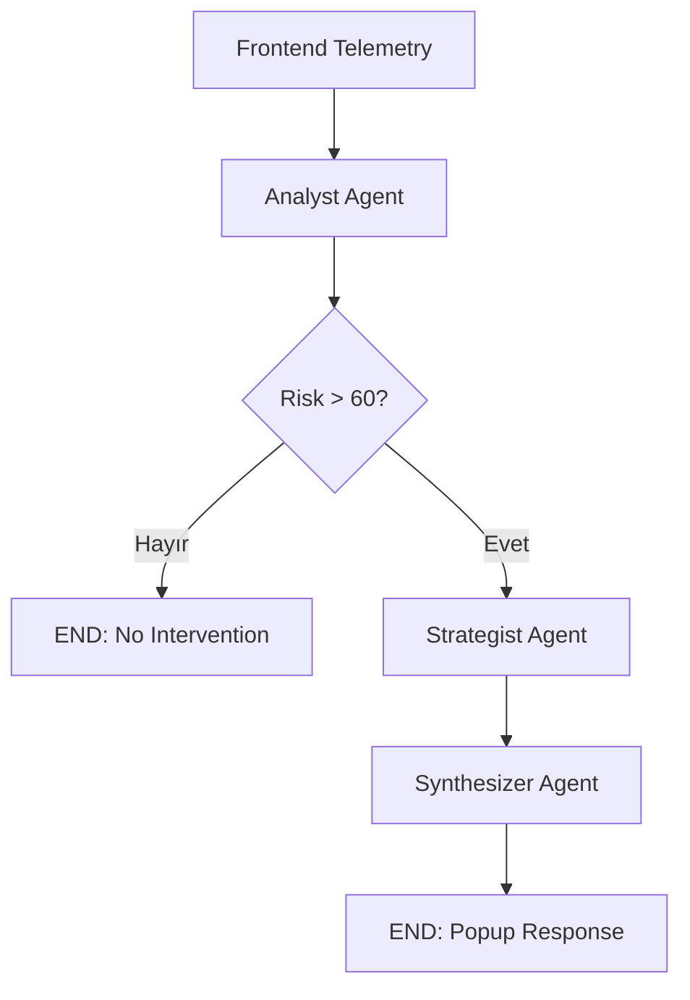

# CartCoach Workflow Contract

Bu doküman CartCoach multi-agent akışının üretime yakın çalışma sözleşmesini tanımlar. Agent mimarisi "kim ne yapar" sorusunu cevaplar; workflow sözleşmesi ise "hangi sırada, hangi veriyle, hangi hata davranışıyla çalışır" sorusunu netleştirir.

## Seçilen Workflow Deseni

CartCoach için seçilen desen: **router destekli sequential workflow**.

Bu desenin seçilme nedeni:

- Sepet terk tespiti sıralı bir karar zinciridir.
- Her ajan bir önceki ajanın sonucuna bağlıdır.
- Düşük riskli kullanıcıda akış erken sonlanarak maliyet azaltılır.
- Demo sırasında her adım ayrı ayrı gösterilebilir.

## LangGraph Akış Şeması



## Node Sözleşmeleri

### 1. Frontend Telemetry

**Amaç:** Kullanıcı davranış sinyallerini ve sepet bilgisini backend'e iletmek.

**Minimum payload:**

```json
{
  "user_id": "usr_9988",
  "idle_time_seconds": 95,
  "cart_items": [
    { "id": "p123", "name": "Apple Watch Series 9", "price": 14999 },
    { "id": "p124", "name": "Apple Watch SE", "price": 9499 }
  ],
  "cart_total": 24498,
  "mouse_movements": "low",
  "scroll_depth": 72,
  "exit_intent": false
}
```

**Validation:**

- `user_id` yoksa anonim demo ID atanır.
- `cart_items` boşsa workflow çalışmaz.
- `cart_total` 0 veya eksikse ürün fiyatlarından hesaplanır.
- Hassas kişisel veri gönderilmez.

### 2. Analyst Agent

**Input contract:**

```json
{
  "user_data": {},
  "user_id": null
}
```

**Output contract:**

```json
{
  "user_id": "usr_9988",
  "risk_score": 85,
  "user_profile": "fiyat duyarlı"
}
```

**Validation gate:**

- `risk_score` integer olmalı.
- Değer 0-100 aralığına sıkıştırılmalı.
- `user_profile` boşsa `analiz edilemedi` atanmalı.

**Fallback:**

Gemini JSON parse hatasında deterministic risk hesaplama kullanılmalı:

- `idle_time_seconds >= 60`: +40
- `abandonment_rate >= 50`: +25
- `cart_items >= 2`: +15
- `exit_intent = true`: +20

Bu fallback demo güvenliği için kritik. İnternet veya API sorunu olsa bile ürün davranışı anlatılabilir.

### 3. Risk Router

**Input contract:**

```json
{
  "risk_score": 85,
  "user_profile": "fiyat duyarlı"
}
```

**Routing rule:**

| Koşul | Sonraki adım | Demo anlamı |
| --- | --- | --- |
| `risk_score <= 60` | `END` | Kullanıcı rahatsız edilmez |
| `risk_score > 60` | `strategist` | Otonom ikna süreci başlar |

**Cost control:**

Router, gereksiz Strategist ve Synthesizer çağrılarını engeller. Bu, performans optimizasyonu ve maliyet kontrolü açısından kritik önem taşır.

### 4. Strategist Agent

**Input contract:**

```json
{
  "risk_score": 85,
  "user_profile": "fiyat duyarlı",
  "user_data": {
    "cart_total": 24498,
    "cart_items": []
  }
}
```

**Output contract:**

```json
{
  "strategy": "15 dakika geçerli kişisel kupon sun...",
  "coupon_details": {
    "coupon_code": "CART1573",
    "discount_ratio": 0.15,
    "discount_amount": 3674.7,
    "new_total": 20823.3,
    "expires_in_minutes": 15,
    "margin_protection_triggered": false
  },
  "comparison_data": {
    "comparison_found": true,
    "verdict": "Series 9 gelişmiş özellik, SE fiyat/performans odaklıdır."
  }
}
```

**Tool routing rules:**

| Sinyal | Tool | Sebep |
| --- | --- | --- |
| `user_profile` içinde `fiyat` | `generate_dynamic_coupon` | Fiyat hassasiyetini dönüştürmek |
| `risk_score > 70` | `generate_dynamic_coupon` | Yüksek terk riski |
| `user_profile` içinde `kararsız` ve 2+ ürün | `get_product_comparison_details` | Karar felcini çözmek |

**Guardrail:**

- İndirim oranı `generate_dynamic_coupon` içinde marj limitine takılmalı.
- Tool sonucu yoksa Strategist kuponsuz veya kıyaslamasız strateji üretmeli.
- Kupon ve kıyaslama aynı anda üretilebilir; bu demo için güçlü bir kombinasyondur.

### 5. Synthesizer Agent

**Input contract:**

```json
{
  "user_profile": "fiyat duyarlı",
  "strategy": "...",
  "coupon_details": {},
  "comparison_data": {}
}
```

**Output contract:**

```json
{
  "final_message": "Karar vermenizi kolaylaştırmak için Apple Watch Series 9 ve SE farkını özetledim. CART1573 koduyla 15 dakika içinde 3.674 TL indirim alabilirsiniz. Hazırsanız sepetinizi birlikte tamamlayalım."
}
```

**Validation gate:**

- Maksimum 4 cümle.
- Kupon varsa kod ve süre görünmeli.
- CTA açık olmalı.
- Mesajda teknik log, model adı veya iç sistem detayı olmamalı.

**Fallback:**

Synthesizer hatasında güvenli statik mesaj:

> Sepetinizdeki ürünler için size özel kısa süreli bir teklif hazırladık. İsterseniz karar vermenizi kolaylaştıracak karşılaştırmayı da gösterebiliriz.

## Workflow State Alanları

| Alan | Sahibi | Yazıldığı node | Okunduğu node |
| --- | --- | --- | --- |
| `user_data` | Frontend | Başlangıç | Analyst, Strategist |
| `user_id` | Analyst | Analyst | Strategist, UI |
| `risk_score` | Analyst | Analyst | Router, Strategist, UI |
| `user_profile` | Analyst | Analyst | Strategist, Synthesizer, UI |
| `strategy` | Strategist | Strategist | Synthesizer, UI |
| `coupon_details` | Strategist tool | Strategist | Synthesizer, UI |
| `comparison_data` | Strategist tool | Strategist | Synthesizer, UI |
| `final_message` | Synthesizer | Synthesizer | Frontend popup |

## Context Bütçesi

Her ajan tüm veriyi değil, yalnızca gerekli özeti almalı.

| Node | Gönderilecek bağlam | Gönderilmemeli |
| --- | --- | --- |
| Analyst | Telemetri, sepet özeti, geçmiş terk oranı | UI metinleri, tüm ürün açıklamaları |
| Strategist | Risk skoru, profil, sepet toplamı, ürün ID'leri | Ham mouse event listesi |
| Synthesizer | Strateji, kupon, kısa kıyaslama verdict'i | Tüm tool logları, debug çıktısı |

## Timeout ve Retry Politikası

Hackathon demosu için önerilen sınırlar:

| Adım | Timeout | Retry | Fallback |
| --- | --- | --- | --- |
| Analyst Gemini çağrısı | 6 sn | 1 | deterministic risk score |
| Strategist Gemini çağrısı | 8 sn | 1 | rule-based strategy |
| Synthesizer Gemini çağrısı | 6 sn | 1 | static popup copy |
| Tool çağrıları | 2 sn | 0 | tool result = null |

## Demo Senaryoları

### Senaryo A: Yüksek Risk + Fiyat Duyarlı

**Beklenen akış:** Analyst -> Router -> Strategist -> Coupon Tool -> Synthesizer.

**Temel Çıktı:** CartCoach gelir kurtarmaya odaklı kişisel teklif üretir.

### Senaryo B: Kararsız Kullanıcı

**Beklenen akış:** Analyst -> Router -> Strategist -> Comparison Tool -> Synthesizer.

**Temel Çıktı:** Sistem sadece indirim değil, karar desteği de verir.

### Senaryo C: Düşük Risk

**Beklenen akış:** Analyst -> Router -> END.

**Temel Çıktı:** CartCoach her kullanıcıyı rahatsız etmez, sadece gerektiğinde devreye girer.

### Senaryo D: Gemini Hatası

**Beklenen akış:** fallback risk/strategy/message ile demo devam eder.

**Temel Çıktı:** Sistem model hatasında çökmek yerine kontrollü davranır.

## UI'da Gösterilecek Agent Timeline

Demo etkisi için frontend'de küçük bir karar günlüğü gösterilmeli:

1. `Telemetry captured`
2. `Analyst calculated risk: 85/100`
3. `Router selected intervention path`
4. `Strategist generated coupon CART1573`
5. `Synthesizer prepared popup`

Bu timeline, Agentic Yapılar puanını görünür hale getirir.

## Uygulama Öncelikleri

1. `main.py` içindeki graph invocation fonksiyonunu API tarafından çağrılabilir saf fonksiyona ayır.
2. `AgentState` içine opsiyonel `workflow_events` alanı ekle.
3. Her node sonunda `workflow_events` listesine kısa karar kaydı yaz.
4. Analyst için deterministic fallback ekle.
5. Strategist için rule-based fallback ekle.
6. Frontend pop-up'ını `final_message`, `coupon_details`, `comparison_data` ile besle.

